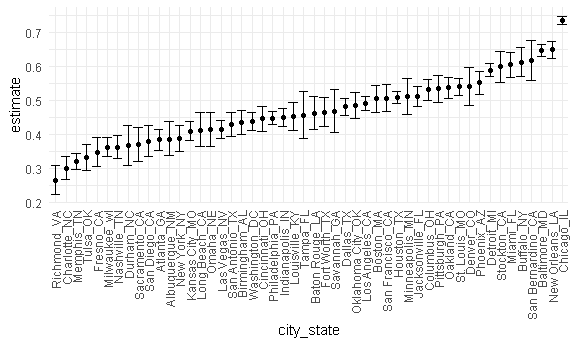

Homewwork 5
================
Yali Zhai
11/13/2020

## Problem 1

Read in the data.

``` r
homicide_df = 
  read_csv("homicide_data/homicide-data.csv") %>% 
  mutate(
    city_state = str_c(city, state, sep = "_"),
    resolved = case_when(
      disposition == "Closed without arrest" ~ "unsolved",
      disposition == "Open/No arrest"        ~ "unsolved",
      disposition == "Closed by arrest"      ~ "solved",
    )
  ) %>% 
  select(city_state, resolved) %>% 
  filter(city_state != "Tulsa_AL")
```

    ## Parsed with column specification:
    ## cols(
    ##   uid = col_character(),
    ##   reported_date = col_double(),
    ##   victim_last = col_character(),
    ##   victim_first = col_character(),
    ##   victim_race = col_character(),
    ##   victim_age = col_character(),
    ##   victim_sex = col_character(),
    ##   city = col_character(),
    ##   state = col_character(),
    ##   lat = col_double(),
    ##   lon = col_double(),
    ##   disposition = col_character()
    ## )

Let’s look at this a bit

``` r
aggregate_df = 
  homicide_df %>% 
  group_by(city_state) %>% 
  summarize(
    hom_total = n(),
    hom_unsolved = sum(resolved == "unsolved")
  )
```

    ## `summarise()` ungrouping output (override with `.groups` argument)

Can I do a prop test for a single city?

``` r
prop.test(
  aggregate_df %>% filter(city_state == "Baltimore_MD") %>% pull(hom_unsolved), 
  aggregate_df %>% filter(city_state == "Baltimore_MD") %>% pull(hom_total)) %>% 
  broom::tidy()
```

    ## # A tibble: 1 x 8
    ##   estimate statistic  p.value parameter conf.low conf.high method    alternative
    ##      <dbl>     <dbl>    <dbl>     <int>    <dbl>     <dbl> <chr>     <chr>      
    ## 1    0.646      239. 6.46e-54         1    0.628     0.663 1-sample~ two.sided

Try to iterate ……..

``` r
results_df = 
  aggregate_df %>% 
  mutate(
    prop_tests = map2(.x = hom_unsolved, .y = hom_total, ~prop.test(x = .x, n = .y)),
    tidy_tests = map(.x = prop_tests, ~broom::tidy(.x))
  ) %>% 
  select(-prop_tests) %>% 
  unnest(tidy_tests) %>% 
  select(city_state, estimate, conf.low, conf.high)
```

``` r
results_df %>% 
  mutate(city_state = fct_reorder(city_state, estimate)) %>% 
  ggplot(aes(x = city_state, y = estimate)) +
  geom_point() + 
  geom_errorbar(aes(ymin = conf.low, ymax = conf.high)) + 
  theme(axis.text.x = element_text(angle = 90, vjust = 0.5, hjust = 1))
```



## Problem 2

Import data and create dataframe.

``` r
path_df = 
  tibble(
    path = list.files("lda-data"),
  ) %>% 
  mutate(
    path = str_c("lda-data/", path),
    data = map(.x = path, ~read.csv(.x))) 
```

Tidy the dataframe.

``` r
study_tidy_df =
path_df %>%
  separate(path, into = c("group", "id"), sep = "_") %>% 
  mutate(
    group =  str_replace(group, "lda-data/con", "control"),
    group =  str_replace(group, "lda-data/exp", "experiment"),
    id = as.numeric(gsub("[^0-9]", "", id))
  ) %>% 
  unnest(data) %>% 
  pivot_longer(
    week_1:week_8,
    names_to = "week", 
    values_to = "value"
  ) %>% 
  mutate(week = gsub("[^0-9]", "", week))
```

Make a spaghetti plot.

``` r
study_tidy_df %>% 
  ggplot(aes(x = week, y = value, group = id)) +
  geom_line() + 
  stat_smooth(aes(group = 1)) + 
  stat_summary(aes(group = 1),
    geom = "point", fun = mean, shape = 17, size = 3) + 
  facet_grid(. ~ group)
```

    ## `geom_smooth()` using method = 'loess' and formula 'y ~ x'


For comparison, I make a smooth line of mean for each group. In the
control group, the mean value is stable during the 8 weeks. But in the
experiment group, the mean value increases gradually with time.
